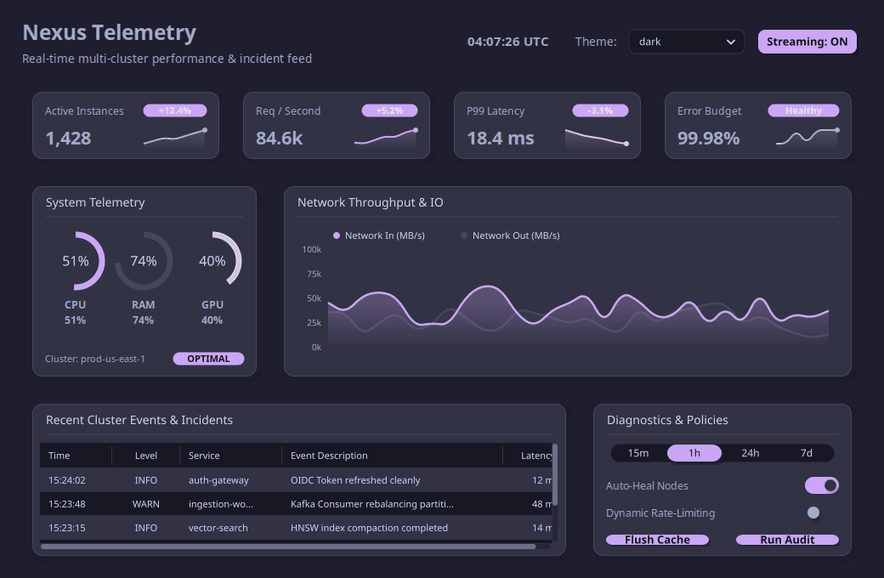
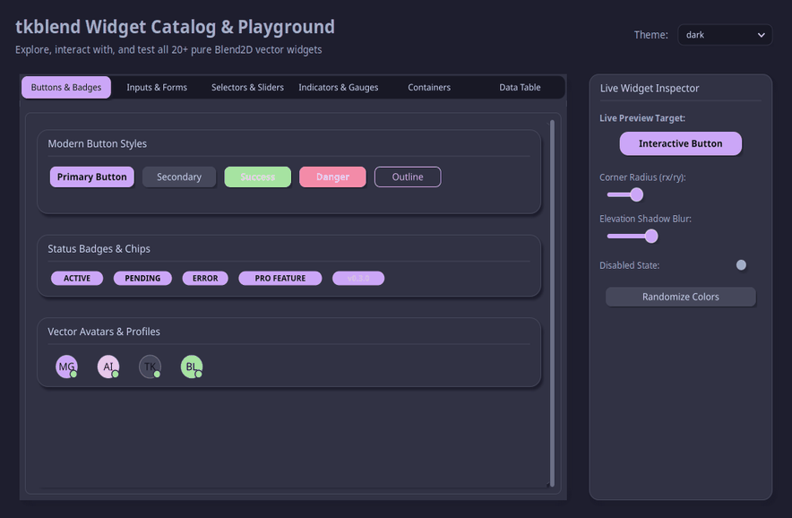
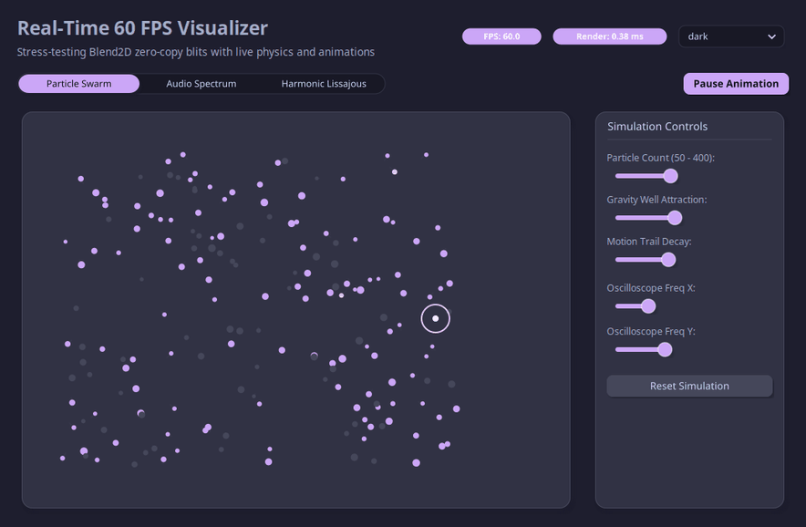
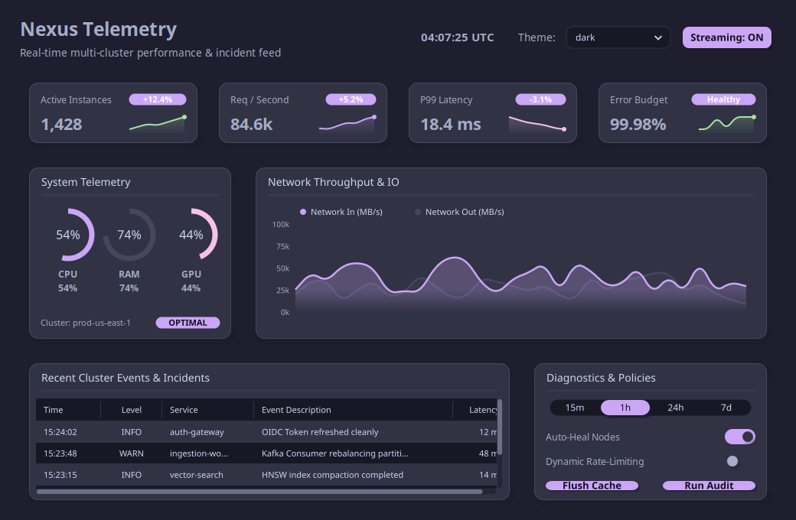
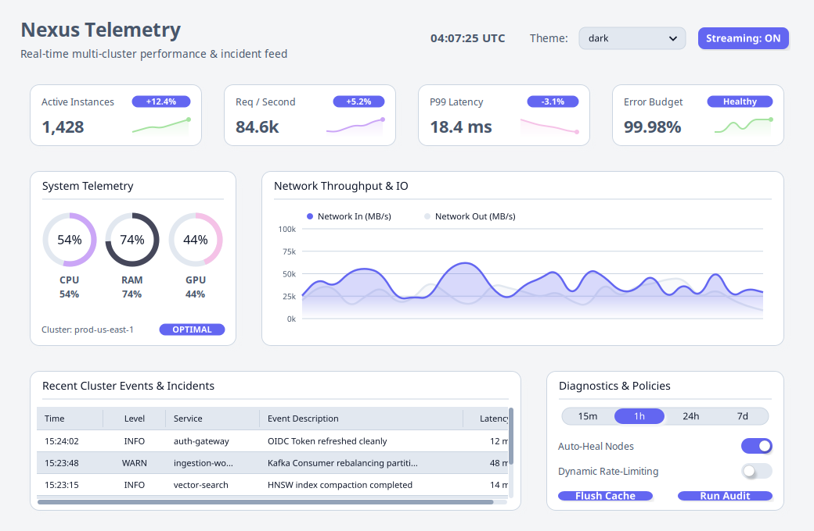
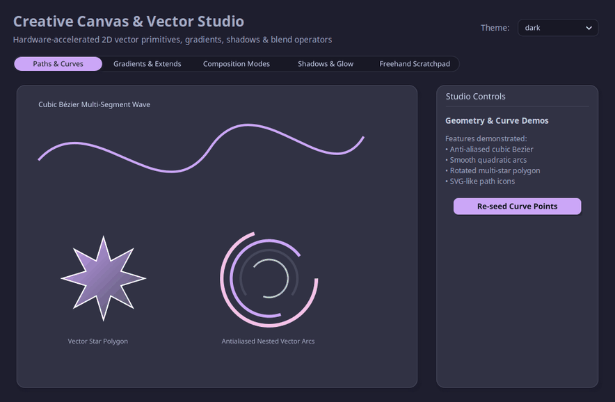
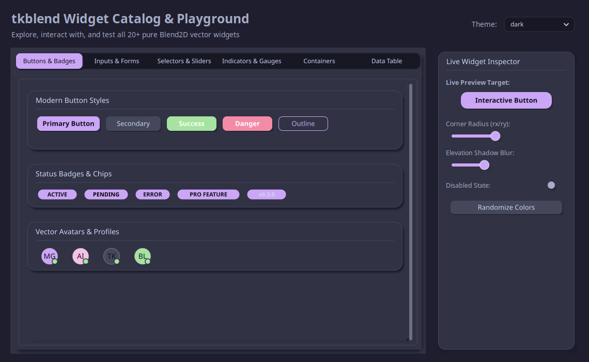

<div align="center">

# ⚡ tkblend

### Modern, Zero-TTK 2D Vector UI & 60+ FPS Graphics Engine for Tkinter
**Powered by Blend2D JIT SIMD Rasterization & Zero-Copy C++ Blitting**

[](https://python.org)
[](https://blend2d.com)
[](#-project-status--experimental-scope)
[](#2--suite-of-20-zero-ttk-vector-widgets)
[](#-performance--benchmarks)
[](LICENSE)

<br/>

<p align="center">
  
</p>

*Live telemetry streaming, dynamic multi-series Bézier curves, radial hardware gauges, and runtime theme switching rendered natively in Python Tkinter.*

</div>

> [!NOTE]
> ### 🧪 Experimental Project & Active Research
> **tkblend** is an experimental research and development project exploring hardware-grade, zero-dependency 2D vector acceleration for standard Python Tkinter. Because this repository serves as an active testbed for bleeding-edge C++ bindings, memory-mapped zero-copy blitting, and declarative vector UI primitives, the codebase evolves rapidly under active prototyping.

---

## 🌟 Overview

**tkblend** brings hardware-grade, modern vector graphics to **Python Tkinter**. By combining high-performance **Blend2D** C++ JIT rasterization with direct zero-copy `Tk_PhotoPutBlock` display buffer blitting, **tkblend** eliminates pixelated scaling, slow software rendering, and archaic Tk widget styling without requiring heavy WebViews, Electron, or external GUI runtimes.

Built strictly with **zero TTK theme dependencies**, **tkblend** provides a complete ecosystem of self-contained vector widgets (`Button`, `Card`, `Slider`, `RangeSlider`, `Switch`, `ProgressBar`, `CircularProgress`, `SegmentedControl`, `TextInput`, `Dropdown`, `SpinBox`, `Badge`, `Avatar`, `Accordion`, `Table`), per-monitor High-DPI scaling, 13+ built-in modern palettes, and an immediate-mode 60+ FPS canvas (`BlendCanvas`).

---

## 🚀 Key Features & Capabilities

---

### 1. ⚡ Zero-Copy Direct C++ Blitting
Pixel buffers render directly inside Blend2D's C++ memory and blit straight into Tkinter's native `tk.PhotoImage` display buffer via `Tk_PhotoPutBlock`.
* **Zero intermediate PIL / Pillow copies**: Eliminates redundant heap allocations and format conversions.
* **Low render latency**: Sub-millisecond (`~0.38 ms`) blits at 1080p, freeing the Python main thread.
* **Bypasses GIL bottlenecks**: Rasterization and memory operations execute in optimized C++ routines.

---

### 2. 🎨 Suite of 20+ Zero-TTK Vector Widgets

<p align="center">
  
</p>

A complete, self-contained suite of rich vector widgets built entirely from scratch with Blend2D:
* **Interactive Controls**: `Button` (Primary, Secondary, Success, Danger, Outline), `Switch`, `Checkbox`, `RadioGroup`, `SegmentedButton`, `SegmentedControl`.
* **Inputs & Steppers**: `TextInput` (with placeholder and focus states), `SpinBox`, `Dropdown`, `OptionMenu`.
* **Progress & Gauges**: `ProgressBar` (linear gradients), `CircularProgress` (radial gauges with custom sweep angles).
* **Containers & Structure**: `Card` (elevated with soft shadows), `Accordion` (collapsible vector sections), `ScrollableFrame`, `Tabview`, `Frame`.
* **Data Presentation**: `Table` (antialiased text, sortable columns, and zebra striping), `Badge`, `Avatar`.

---

### 3. 🚀 60+ FPS Real-Time Vector Canvas (`BlendCanvas`)

<p align="center">
  
</p>

An immediate-mode vector drawing widget capable of sustained 60 - 240+ FPS animations:
* **Immediate-Mode Callback**: Simply pass `on_draw(s: Surface)` and redraw dynamically on tick or resize.
* **Physics & Telemetry Ready**: Easily power particle systems, harmonic oscilloscopes, and 32-band audio spectrum equalizers.
* **Seamless Tkinter Layout**: Embeds like any standard Tk widget with `pack()`, `grid()`, or `place()`.

---

### 4. 🌓 Dynamic Palette System (13+ Curated Themes)

<p align="center">
  
  
</p>

* **Zero-Flicker Live Switching**: Switch themes instantly at runtime via `set_theme("catppuccin_mocha")` or `set_theme("light")`.
* **13+ Built-in Modern Presets**: `DARK`, `LIGHT`, `CATPPUCCIN_MOCHA`, `TOKYO_NIGHT`, `CYBERPUNK`, `DRACULA`, `EMERALD_FOREST`, `NORD`, `SUNSET_AMBER`, `MONOKAI_PRO`, `SOLARIZED_DARK`, `SOLARIZED_LIGHT`.
* **Automatic Hierarchy Propagation**: Containers automatically cascade background tokens down the widget tree.

---

### 5. 📐 Vector Studio & Custom Widget Cookbook

<p align="center">
  
</p>

Easily create custom vector widgets by subclassing `Widget`:
* **Mathematical Vector Curves**: Cubic & quadratic Bézier paths, arcs, and arbitrary SVG-like polygons.
* **Multi-Stop Shaders**: Linear and radial gradients with custom focal points and extend modes (`PAD`, `REPEAT`, `REFLECT`).
* **Soft Shadows**: 3-pass separable box-blur drop shadows with configurable blur radius, spread, elevation, and opacity.
* **Composition Operators**: Complete channel math visualization (`SRC_OVER`, `MULTIPLY`, `SCREEN`, `OVERLAY`, `PLUS`, etc.).

---

### 6. 🖥️ Per-Monitor High-DPI Coordinate Scaling
* Integrated `ScalingTracker` handles automatic logical-to-physical coordinate conversion across 1080p, 2K, 4K Retina, and multi-monitor setups.
* Borders, corner radii, and vector paths scale proportionally without blurriness or pixelation.

---

### 7. 🌉 CustomTkinter Acceleration Bridge (`tkblend.ctk`)
* Drop-in Blend2D vector acceleration for existing CustomTkinter applications.
* Intercepts CTk canvas drawing passes and renders them with subpixel anti-aliasing to eliminate jagged edges.

---

## 📊 Performance & Benchmarks

Because **tkblend** blits raw C++ pixel buffers straight into Tkinter's internal `Tk_PhotoPutBlock` C-API, it completely bypasses Python GIL overhead, PIL buffer copies, and X11/Win32 GDI drawing bottlenecks:

| Rendering Engine | Draw Latency (1080p) | Max Framerate | Antialiasing Quality | TTK Dependency |
| :--- | :---: | :---: | :---: | :---: |
| **⚡ tkblend (Blend2D + Zero-Copy)** | **0.38 ms** | **60 - 240+ FPS** | **Subpixel 32x Analytic (JIT SIMD)** | **None (Pure Vector)** |
| 🐢 Standard `tkinter.Canvas` | 14.20 ms | ~45 FPS | Rough / None | None |
| 🔄 PIL / Pillow `ImageTk.PhotoImage` | 8.65 ms | ~50 FPS | Software Rasterized | N/A |
| 📦 TTK Styled Elements | N/A | OS Dependent | Bitmap / Clustered Engine | High (Tcl/Tk Theme Engine) |

---

## ⚡ Quick Start: Modern Vector Widgets

```python
import tkinter as tk
from tkblend import (
    Card,
    Button,
    Slider,
    Switch,
    ProgressBar,
    CircularProgress,
    Badge,
    set_theme,
)

root = tk.Tk()
root.title("tkblend Modern Vector UI")
root.geometry("460x580")
root.configure(bg="#1e1e2e")

# Elevated card container with soft drop shadow
card = Card(root, title="Hardware Metrics", width=400, height=500, rx=14, ry=14)
card.pack(padx=20, pady=20, fill="both", expand=True)

# Radial gauge & linear progress bar
gauge = CircularProgress(card.body, size=110, value=75.0, unit="%")
gauge.pack(pady=10)

pbar = ProgressBar(card.body, width=280, value=75.0)
pbar.pack(pady=8)

# Smooth slider controlling both gauges
def on_slider(val):
    gauge.set_value(val)
    pbar.set_value(val)

slider = Slider(card.body, width=280, value=75.0, command=on_slider)
slider.pack(pady=8)

# Toggle switch and theme switcher button
switch = Switch(card.body, text="Turbo Acceleration", is_on=True)
switch.pack(pady=10)

btn = Button(
    card.body,
    text="Toggle Dark / Light Theme",
    bootstyle="primary",
    command=lambda: set_theme("light" if switch.is_on else "catppuccin_mocha"),
)
btn.pack(pady=8)

root.mainloop()
```

---

## 🚀 Quick Start: 60 FPS High-Speed Canvas

```python
import tkinter as tk
from tkblend import BlendCanvas, Surface, LinearGradient

root = tk.Tk()
root.title("tkblend 60 FPS Canvas")
root.geometry("640x420")

def on_draw(s: Surface):
    w, h = s.width, s.height
    s.clear("#11111b")
    
    # Modern card container with soft 3-pass box-blur drop shadow
    s.draw_card(24, 24, w - 48, h - 48, rx=16, ry=16, bg_color="#181825", shadow_blur=16.0)
    
    # Dynamic multi-stop linear gradient
    grad = LinearGradient(48, 0, w - 48, 0)
    grad.add_stop(0.0, "#89b4fa").add_stop(0.5, "#cba6f7").add_stop(1.0, "#a6e3a1")
    
    # Antialiased vector text and smooth rounded progress bar
    s.draw_text("⚡ Blend2D High-Speed Canvas", 48, 70, font_size=16, color="#cdd6f4")
    s.fill_rounded_rect(48, 100, w - 96, 10, 5, 5, grad)

canvas = BlendCanvas(root, width=640, height=420, on_draw=on_draw)
canvas.pack(fill="both", expand=True)

root.mainloop()
```

---

## 🕹️ Interactive Showcase Hub

Explore all interactive demos, SaaS dashboards, physics visualizers, and widget showrooms directly via the **Unified Showcase Hub**:

```bash
uv run python examples/hub.py
```

<p align="center">
  
</p>

### Included Showcases

* 📊 **[Analytics Telemetry Dashboard](file:///home/mateusgp/projects/tkblend/examples/analytics_dashboard.py)** (`examples/analytics_dashboard.py`): Real-time hardware radial gauges, streaming Bézier area charts, and incident data tables.
* 🎛️ **[Widget Catalog & Playground](file:///home/mateusgp/projects/tkblend/examples/widget_gallery.py)** (`examples/widget_gallery.py`): Interactive showroom of all 20+ zero-TTK widgets with live corner-radius, elevation blur, and palette inspectors.
* 🚀 **[60 FPS Real-Time Visualizer](file:///home/mateusgp/projects/tkblend/examples/realtime_visualizer.py)** (`examples/realtime_visualizer.py`): 200+ particle physics simulation with cursor gravity wells and 32-band neon audio equalizer.
* 🎨 **[Creative Canvas Studio](file:///home/mateusgp/projects/tkblend/examples/canvas_studio.py)** (`examples/canvas_studio.py`): Cubic Bézier ribbons, composition blend modes, multi-stop gradients, and vector scratchpad.
* 👨‍🍳 **[Custom Widget Cookbook](file:///home/mateusgp/projects/tkblend/examples/custom_widget_cookbook.py)** (`examples/custom_widget_cookbook.py`): Developer reference for subclassing `Widget` to build radar charts, speedometer dials, step wizards, and color wheels.
* 🌉 **[CustomTkinter Acceleration Bridge](file:///home/mateusgp/projects/tkblend/examples/ctk_showcase.py)** (`examples/ctk_showcase.py`): Drop-in Blend2D vector acceleration for existing CustomTkinter apps.

See the [Examples Documentation](file:///home/mateusgp/projects/tkblend/examples/README.md) for full walkthroughs.

---

## 📦 Installation

```bash
pip install tkblend
```

### System Requirements
* **Python**: 3.9, 3.10, 3.11, 3.12, or 3.13
* **Tkinter**: Standard Tcl/Tk 8.6+ (included with standard Python installations on Windows, macOS, and Linux)
* **Platforms**: Linux (x86_64, aarch64), macOS (Apple Silicon M1/M2/M3, Intel), Windows (x64)

### Building from Source

```bash
git clone --recursive https://github.com/mateusgp/tkblend.git
cd tkblend
uv pip install -e .
```

---

## 🎨 Dynamic Theme Engine

Switch between 13+ modern built-in palettes at runtime with zero window flicker:

```python
from tkblend import set_theme

# Switch to popular themes
set_theme("catppuccin_mocha")
set_theme("tokyo_night")
set_theme("cyberpunk")
set_theme("dracula")
set_theme("nord")
set_theme("emerald_forest")
set_theme("sunset_amber")
set_theme("light")
```

---

## 📄 License

**tkblend** is licensed under the **Business Source License 1.1 (BSL 1.1)**.

* **Free Use Grant**: You may use **tkblend** freely for non-production, testing, development, and evaluation purposes.
* **Production & Commercial Use**: Production or commercial deployment requires a separate commercial license from the Licensor.
* **Conversion to Open Source**: On **January 1, 2030** (the Change Date), the license automatically converts to the standard **MIT License**.

See the full [LICENSE](LICENSE) file for complete details. For commercial inquiries, please reach out via GitHub.

Blend2D is licensed under the [Zlib License](https://blend2d.com).
