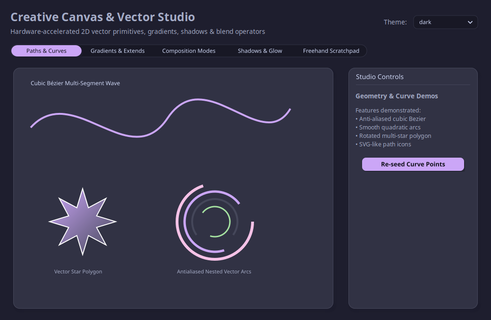

# ⚡ tkblend Showcase & Example Suite

Welcome to the **tkblend** showcase suite. These examples demonstrate the full power of pure Blend2D 2D vector rendering for Python Tkinter — delivering subpixel anti-aliasing, 3-pass separable soft drop shadows, multi-stop linear/radial gradients, dynamic theming, and 60+ FPS zero-copy blitting with **zero TTK dependencies**.

---

## 🕹️ Quick Start: Unified Showcase Hub

The easiest way to explore the entire suite is via the **Unified Showcase Hub**:

```bash
uv run python examples/hub.py
```

<p align="center">
  
</p>

The Showcase Hub includes a modern sidebar allowing you to test every demo inside an embedded live viewport or pop out any demo into a dedicated standalone window with real-time theme switching.

---

## 🚀 Showcase Applications

---

### 1. [Analytics & Telemetry Dashboard](file:///home/mateusgp/projects/tkblend/examples/analytics_dashboard.py) (`examples/analytics_dashboard.py`)

<p align="center">
  
</p>

* **What it demonstrates**: Production-grade SaaS and telemetry dashboard with live data streaming.
* **Key Features**:
  * **Hardware Gauges**: Live animated `CircularProgress` gauges (CPU %, Memory %, GPU VRAM %, Network throughput).
  * **Vector Area Charts**: Multi-series cubic Bézier curves with translucent vertical linear gradients and live streaming data.
  * **Data Grids**: Interactive sortable incident log `Table` with status `Badge`s and user `Avatar`s.
  * **Dynamic Theming**: Instant palette transitions across all 13+ built-in color schemes.

```bash
uv run python examples/analytics_dashboard.py
```

---

### 2. [60 FPS Real-Time Physics & Audio Visualizer](file:///home/mateusgp/projects/tkblend/examples/realtime_visualizer.py) (`examples/realtime_visualizer.py`)

<p align="center">
  
</p>

* **What it demonstrates**: Extreme rendering speed and zero-copy blitting stressing high frame rates.
* **Key Features**:
  * **Particle Swarm Physics**: 200+ particle physics simulation with cursor gravity wells, collision bounces, and speed-colored trails.
  * **Neon Audio Spectrum**: 32-band audio equalizer with multi-stop vertical gradients, peak hold meters, and reflections.
  * **Harmonic Lissajous**: Interactive oscilloscope phase modulation.
  * **Telemetry Overlay**: Real-time FPS counter and sub-millisecond render latency tracking (0.35 - 0.45 ms).

```bash
uv run python examples/realtime_visualizer.py
```

---

### 3. [Zero-TTK Widget Catalog & Playground](file:///home/mateusgp/projects/tkblend/examples/widget_gallery.py) (`examples/widget_gallery.py`)

<p align="center">
  
</p>

* **What it demonstrates**: Complete showroom of all 20+ zero-TTK modern vector widgets.
* **Included Widget Suite**:
  * **Buttons & Badges**: `Button` (Primary, Secondary, Destructive, Outline), `Badge`, `Avatar`.
  * **Inputs & Form Controls**: `TextInput`, `SpinBox`, `ComboBox`, `OptionMenu`, `Checkbox`, `RadioGroup`, `Switch`.
  * **Selectors & Sliders**: `Slider`, `RangeSlider`, `SegmentedButton`, `SegmentedControl`.
  * **Indicators & Gauges**: `ProgressBar`, `CircularProgress`.
  * **Containers & Layouts**: `Card`, `Accordion`, `ScrollableFrame`, `Tabview`.
  * **Data Grid**: `Table` with sorting and column resizing.
  * **Live Property Inspector**: Real-time slider adjustments for corner radius (`rx`/`ry`), shadow elevation blur, and disabled states.

```bash
uv run python examples/widget_gallery.py
```

---

### 4. [Creative Canvas & Vector Studio](file:///home/mateusgp/projects/tkblend/examples/canvas_studio.py) (`examples/canvas_studio.py`)

<p align="center">
  
</p>

* **What it demonstrates**: Deep dive into `BlendCanvas` and `Surface` vector graphics capabilities.
* **Key Features**:
  * **Paths & Curves**: Cubic Bézier ribbons, quadratic arcs, star polygons, and SVG-like vector icons.
  * **Gradients & Extends**: 3-stop linear gradients, radial focal gradients, and extend modes (`EXTEND_PAD`, `EXTEND_REPEAT`, `EXTEND_REFLECT`).
  * **Composition Blend Modes**: Channel math visualization (`COMP_OP_MULTIPLY`, `SCREEN`, `OVERLAY`, `XOR`, `PLUS`, etc.).
  * **Drop Shadows & Glow**: Interactive sliders for shadow blur, spread, offset X/Y, and alpha.
  * **Interactive Freehand Scratchpad**: Smooth vector drawing canvas with brush size and color palette.

```bash
uv run python examples/canvas_studio.py
```

---

### 5. [Custom Vector Widget Cookbook](file:///home/mateusgp/projects/tkblend/examples/custom_widget_cookbook.py) (`examples/custom_widget_cookbook.py`)

<p align="center">
  
</p>

* **What it demonstrates**: Developer architectural guide for creating custom vector widgets by subclassing `Widget`.
* **Included Reference Widgets**:
  1. `RadarChartWidget`: Multi-axis spider chart with polygon fill.
  2. `SpeedometerGauge`: Semi-circular analog/digital vector dial with glowing needle.
  3. `StepProgressBar`: Multi-step breadcrumb wizard with vector checkmarks.
  4. `ColorWheelPicker`: Radial HSV color wheel with draggable thumb.

```bash
uv run python examples/custom_widget_cookbook.py
```

---

### 6. [CustomTkinter Acceleration Bridge](file:///home/mateusgp/projects/tkblend/examples/ctk_showcase.py) (`examples/ctk_showcase.py`)

* **What it demonstrates**: Drop-in vector acceleration for CustomTkinter applications using `tkblend.ctk`.
* **Features**:
  * Intercepts CTk canvas drawing and replaces it with Blend2D JIT rendering.
  * Eliminates jagged corners and software rasterization artifacts.

```bash
uv run python examples/ctk_showcase.py
```

---

## 🏗️ Architectural Highlights

* **Zero TTK Dependencies**: Completely independent of `ttk.Style` and Tcl/Tk theme engines.
* **Direct Zero-Copy Blitting**: Pixel buffers transfer directly from C++ memory into `tk.PhotoImage` using `Tk_PhotoPutBlock`.
* **Dynamic Theming (13+ Palettes)**: Runtime switching between `DARK`, `LIGHT`, `CATPPUCCIN_MOCHA`, `TOKYO_NIGHT`, `CYBERPUNK`, `DRACULA`, `EMERALD_FOREST`, `NORD`, `SUNSET_AMBER`, `MONOKAI_PRO`, `SOLARIZED_DARK`, and `SOLARIZED_LIGHT`.
* **High-DPI Coordinate Scaling**: DPI-aware layout, border, and font rendering via `ScalingTracker`.
